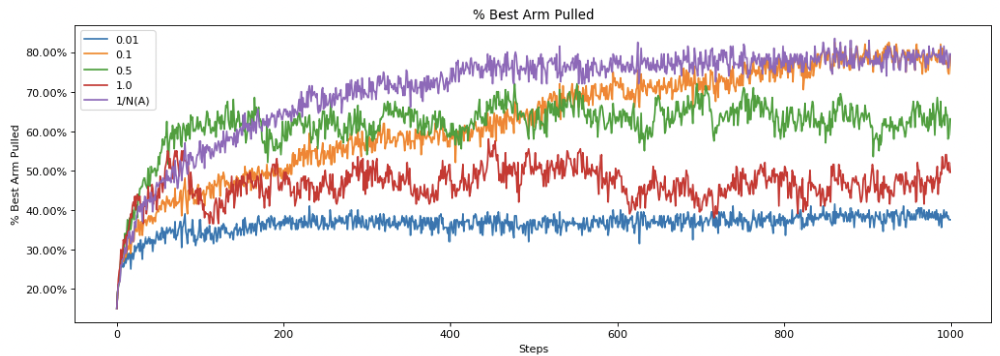

# Reinforcement Learning Specialization
This repo contains the worked projects (and some quizzes) of each of the courses in the specialization [Reinforcement Learning Specialization](https://www.coursera.org/specializations/reinforcement-learning) offered by the University of Alberta. 
## Prerequisites
The jupyter notebooks require [Jupyter Dynamic Classes](https://alexhagen.github.io/jdc/).

Install it via
`pip install jdc`

## Projects
### Course 1: Fundamentals of reinforcement learning
- #### [Bandits](fundamentals-of-reinforcement-learning/Bandits)
<figure>
  
  <figcaption> Bandit game: Percentage of best arm pulled vs step sizes of Epsilon Greedy Agent.</figcaption>
</figure>

- #### [Dynamic Programming](fundamentals-of-reinforcement-learning/DynamicProgramming)

### Course 2: Sample based learning methods
- #### [Blackjack](sample-based-learning-methods/Blackjack)
- #### [Policy Evaluation with Temporal Difference Learning](sample-based-learning-methods/Policy%20Evaluation%20with%20Temporal%20Difference%20Learning)
- #### [Q-Learning and Expected Sarsa](sample-based-learning-methods/Q-Learning%20and%20Expected%20Sarsa)
<figure>
  
  <figcaption>Expected Sarsa shows an advantage over Q-learning in this problem across a wide range of step-sizes.</figcaption>
</figure>

- #### [Dyna-Q](sample-based-learning-methods/Dyna-Q)

### Course 3: Prediction control function approximation
- #### [Semi gradient TD(0) with state aggregation](prediction-control-function-approximation/StateAgg)
- #### [Semi gradient TD with a neural network](prediction-control-function-approximation/TD-NN)
<figure>
  
  <figcaption>Semi-gradient TD with tile-coding is much faster than semi-gradient TD with a neural network. Semi-gradient TD with tile-coding also has a lower RMSVE at the end of 5000 episodes.</figcaption>
</figure>

- #### [Function approximation and control](prediction-control-function-approximation/Control)
<figure>
  
  <figcaption>The car is under-powered so the agent needs to learn to rock back and forth to get enough momentum to reach the goal. 
The difficulty is that gravity is stronger than the car’s engine, and even at full throttle the car cannot accelerate up the steep slope. The only solution is to first move away from the goal and up the opposite slope on the left. Then, by applying full throttle the car can build up enough inertia to carry it up the steep slope even though it is slowing down the whole way.
</figcaption>
</figure>

- #### [Average reward softmax actor critic using tile coding](prediction-control-function-approximation/Avg-Reward)

### Course 4: Complete reinforcement learning system
- #### [Moonshot Technologies](complete-reinforcement-learning-system/Week%201)
- #### [Implement your agent](complete-reinforcement-learning-system/Week%205)
<figure>
  
  <figcaption>The agent initially crashes quite quickly (Episode 0). Then, the agent learns to avoid crashing by expending fuel and staying far above the ground. Finally  it learns to land smoothly within the landing zone demarcated by the two flags (Episode 275).</figcaption>
</figure>
<figure>
  
  <figcaption>The video shows 300 episodes and one trajectory. To understand how the agent performs in the long run, we can look at the learning curve for the agent trained for 3000 episodes with performance averaged over 30 trajectories.</figcaption>
</figure>

- #### [Completing the parameter study](complete-reinforcement-learning-system/Week%206)
